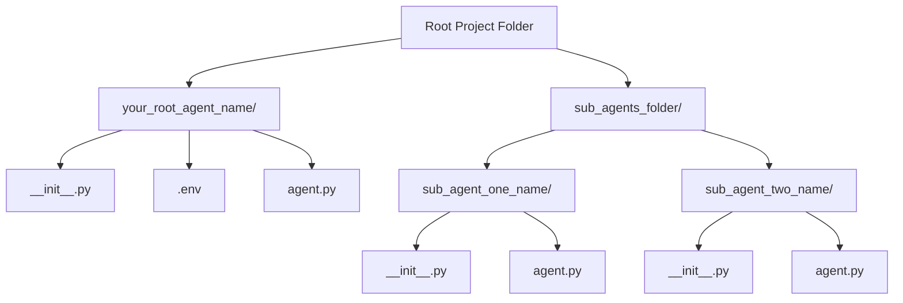
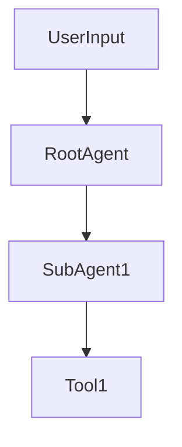
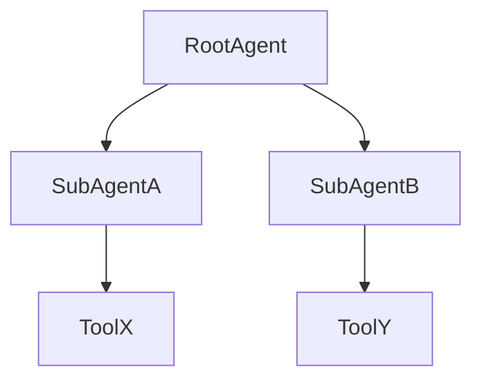
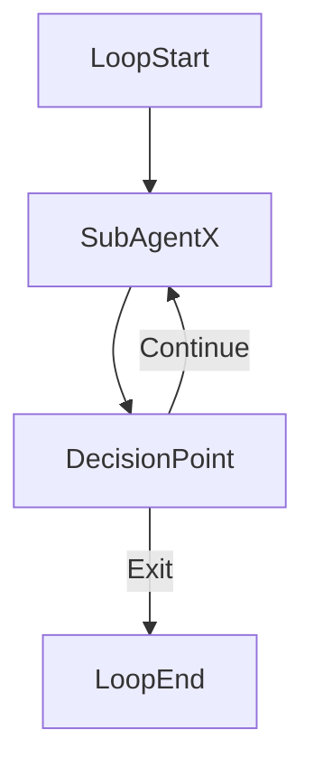

# Creating Robust AI Projects with Google Agent Development Kit (ADK): Best Practices and Key Considerations

## Introduction

Google's Agent Development Kit (ADK) provides a powerful and extensible foundation for building LLM-powered AI agents. As more developers and organizations adopt ADK, it's crucial to understand the best practices and common patterns that support scalable, maintainable, and effective agent-based solutions.

This document outlines the key design patterns, folder structures, and development tips essential for creating robust AI projects using ADK. It draws from reverse-engineering sample projects, deep dives into the ADK source code, and learnings from whiteboard sessions by the ADK team.

---

## Agent Types and Execution Modes

ADK supports multiple ways to define and execute agents:

### 1. Declarative Agent Definitions

Agents can be declared using Python code directly. A typical pattern involves defining the `agent` object using properties like `name`, `model`, `instructions`, and `tools`.

### 2. YAML-Based Configuration

You can also use YAML files to define your agent configuration. This mode is particularly useful for deploying or templating agents across environments.

### 3. CLI-Based Execution

The ADK CLI provides direct commands to run agents and generate output. You can execute agents with commands like:

```bash
adk run <agent_folder>
```

Or override values inline:

```bash
adk run <agent_folder> --inputs.user_input="What’s the capital of France?"
```

---

## Folder Structure Best Practices

The Agent Development Kit (ADK) requires a specific folder structure for building and running your AI agents. This structure helps ADK identify and manage your agents and their associated components.

### General Agent Folder Structure (Applicable to Single and Sub-Agents)

For any agent, ADK requires a particular format for it to run. Each agent resides within its own folder, and this folder must contain specific core components:

* **Agent Folder**: This is the top-level folder for your agent.

  * The **name of this folder must exactly match the `name` property defined for your agent** within its `agent.py` file. If the names do not match, ADK will encounter errors. For example, if your agent is named `greeting_agent`, your folder should also be `greeting_agent/`.
* `__init__.py` file: Marks the directory as a Python package, enabling agent imports.
* `agent.py` file: Contains the agent’s core logic and metadata.
* `.env` file:

  * For single agents, place it inside the agent's root folder.
  * For multi-agent setups, place a single `.env` file in the **root agent folder** only.

### Ideal Folder Structure for a Single Agent

```text
your_project/
└── your_single_agent_name/
    ├── __init__.py
    ├── .env
    └── agent.py
```

* `agent.py` should define the agent’s `name`, `model`, `description`, and `instructions`.
* The folder name must match the `name` field in `agent.py`.

### Ideal Folder Structure for Multi-Agent Systems

Multi-agent systems typically involve a **root agent** (acting as a manager) and multiple **sub-agents**.

```text
your_multi_agent_project/
├── your_root_agent_name/
│   ├── __init__.py
│   ├── .env
│   └── agent.py
└── sub_agents_folder/
    ├── sub_agent_one_name/
    │   ├── __init__.py
    │   └── agent.py
    └── sub_agent_two_name/
        ├── __init__.py
        └── agent.py
```

* The `sub_agents` property in the root agent’s `agent.py` will import and list these agents.
* Sub-agents require their own folders and should include `description` fields to support effective delegation.

### Ideal Folder Structure for Tools

You can define tools directly in `agent.py`, but for better modularity:

```text
your_agent_name/
├── __init__.py
├── agent.py
└── tools.py
```

* `tools.py` stores reusable Python functions that can be registered as tools.
* Helps keep `agent.py` clean and focused on orchestration.

### Mermaid Diagram: Folder Architecture



---

## Workflow Representation

ADK supports complex workflows involving multiple agents and tools. These can be visualized using workflow diagrams and modular delegation patterns.

### Sequential Delegation Example



### Parallel Sub-Agent Execution



### Looping Over Sub-Agents



---

## Environment Variables and Configuration

* Keep a single `.env` file for multi-agent systems at the root level.
* Avoid hard-coding API keys or model names in `agent.py` — use environment variables instead.
* Use Python's `os.environ.get()` to access these variables safely.

---

## Common Pitfalls and How to Avoid Them

| Issue                 | Cause                        | Fix                                          |
| --------------------- | ---------------------------- | -------------------------------------------- |
| Agent not recognized  | Folder name mismatch         | Ensure folder name = `name` in `agent.py`    |
| Missing tools         | Tool not registered          | Explicitly import and register in `tools.py` |
| Sub-agent not invoked | Not included in `sub_agents` | Add to `sub_agents` list in root agent       |

---

## Pseudo-Code and Workflow Strategy

### Pseudo-Code Style

The ADK ecosystem prefers real Python code over abstract pseudocode. Most design discussions revolve around how agents introspect tools and delegate via code-based orchestration.

```python
def agent_logic():
    if "translate" in user_input:
        use(sub_agent_translate)
    elif "summarize" in user_input:
        use(sub_agent_summarizer)
```

### Workflow Strategy

Agent workflows are designed like trees or graphs — with the root agent orchestrating branches of sub-agents or tools.

Whiteboard sessions with the ADK team emphasize:

* Building logic in the root agent
* Keeping sub-agents focused and modular
* Defining clear descriptions for delegation

## Summary of Best Practices

* **Match folder names and `agent.py` `name` properties** to avoid ADK runtime errors.
* **Use shared state** for information passing between agents.
* **Keep tool logic modular** using `tools.py`.
* **Leverage callbacks** to log, validate, and customize agent behavior.
* **Use workflow agents** (sequential, parallel, loop) to build scalable, composable systems.

## Pseudo-Code and Workflow Guidance

ADK takes a **code-first** approach. While many examples look like pseudo-code, they are actual Python implementations illustrating key concepts. Workflow diagrams are not stored in a dedicated folder but are often explained visually during design discussions or whiteboard sessions.

## Conclusion

Building AI projects with ADK demands thoughtful planning around folder structures, agent definitions, environment configurations, and tool modularity. By following these practices and visualizing workflows, you can create scalable and maintainable agent ecosystems aligned with Google’s design philosophy.