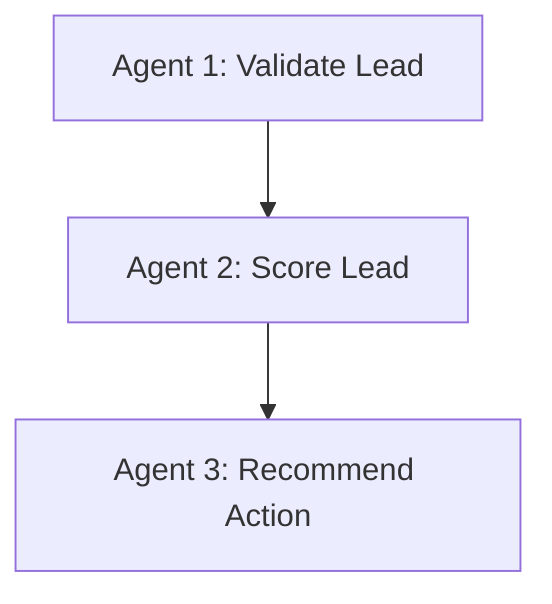
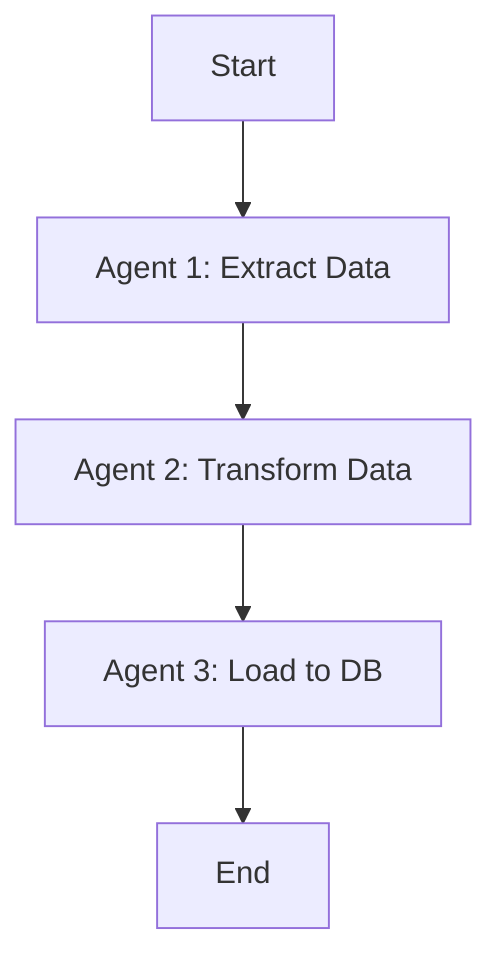
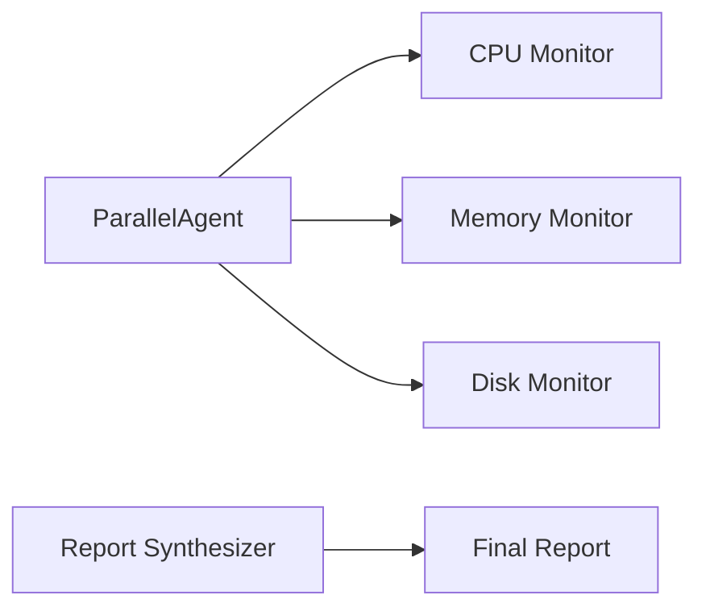
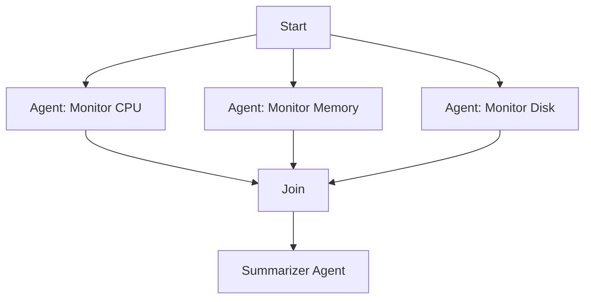
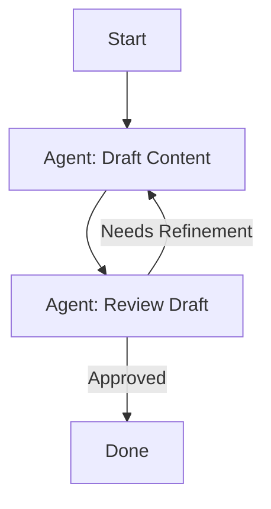
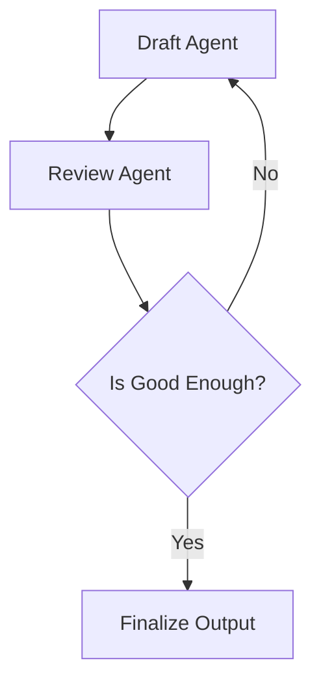

# Callbacks and Agent Workflows in Google Agent Development Kit (ADK)

## Overview

Google's Agent Development Kit (ADK) supports robust agent orchestration via **callbacks** and **workflow agents**. These features provide granular control over agent behavior and lifecycle, enabling sophisticated AI agent architectures that are modular, reactive, and scalable.

---

## 1. Callbacks in ADK

Callbacks are functions triggered at specific points during an agent's execution. ADK provides **six types** of callbacks, allowing you to customize behavior at every stage of an agent’s lifecycle.

### 1.1 Before Agent Callback

* **Trigger**: Before any agent logic is executed.
* **Purpose**: Initialize resources, hydrate state, logging, start timers.
* **Parameters**: `callback_context`
* **Return Type**: `Optional[Content]`

**Use Case Example**: Retrieve user profile and order history before starting agent logic.

### 1.2 After Agent Callback

* **Trigger**: After the agent completes its logic.
* **Purpose**: Post-execution logging, auditing, performance monitoring.
* **Parameters**: `callback_context`

**Use Case Example**: Store duration and success metrics after agent finishes.

### 1.3 Before Model Callback

* **Trigger**: Before sending a request to an LLM.
* **Purpose**: Modify instructions, inject examples, apply guardrails.
* **Parameters**: `callback_context`, `LLM_request`

**Use Case Example**: Check for profanity in prompt before querying LLM.

### 1.4 After Model Callback

* **Trigger**: After receiving a response from an LLM.
* **Purpose**: Modify output, redact sensitive info, log.
* **Parameters**: `callback_context`, `LLM_request`, `LLM_response`

**Use Case Example**: Mask user emails or credit card info in the response.

### 1.5 Before Tool Callback

* **Trigger**: Before a tool is invoked.
* **Purpose**: Modify tool arguments, authorize access.
* **Parameters**: `tool`, `arguments`, `tool_context`

**Use Case Example**: Ensure a user requesting billing data has admin rights.

### 1.6 After Tool Callback

* **Trigger**: After a tool completes execution.
* **Purpose**: Modify tool result, log, or store outputs in state.
* **Parameters**: `tool`, `arguments`, `tool_context`, `tool_response`

**Use Case Example**: Enrich tool output with additional metadata.

---

## 2. Workflow Agents in ADK

ADK allows orchestration of multiple agents using three main workflow types:

### 2.1 Sequential Agents

* **Definition**: Agents execute one after the other in a fixed order.
* **Use Case**: Pipelines with strict dependencies (e.g., validation → scoring → recommendation).
* **Key Point**: Use shared state to pass data between agents.



#### Use Case

Useful for dependent tasks like ETL (Extract → Transform → Load).

#### Diagram



#### Pseudo-code Example

```python
from google.generativeai.agent import SequentialAgent

agent = SequentialAgent(
    name="etl_pipeline",
    sub_agents=[extract_agent, transform_agent, load_agent]
)
```

### 2.2 Parallel Agents

* **Definition**: Multiple agents execute simultaneously.
* **Use Case**: Speed-critical operations like analytics, where tasks are independent.
* **Key Point**: Results stored in shared state, later accessed by a consolidator agent.



#### Use Case

Great for performance-critical tasks like monitoring or multi-modal sensing.

#### Diagram



#### Pseudo-code Example

```python
from google.generativeai.agent import ParallelAgent

parallel_monitor = ParallelAgent(
    name="system_monitor",
    sub_agents=[cpu_agent, mem_agent, disk_agent]
)
```

### 2.3 Loop Agents

* **Definition**: Agents execute repeatedly until a condition or max iteration is met.
* **Use Case**: Iterative refinement, such as writing, debugging, or summarizing.
* **Exit Triggers**:

  * `max_iterations` reached
  * Agent calls `exit_loop(escalate=True)`



#### Use Case

Ideal for refinement cycles like drafting, reviewing, and improving until quality is met.

#### Diagram



#### Pseudo-code Example

```python
from google.generativeai.agent import LoopAgent

loop_writer = LoopAgent(
    name="post_generator",
    sub_agents=[draft_agent, review_agent],
    max_iterations=5
)
```

Within a loop agent, sub-agents can call `exit_loop(escalate=True)` to signal completion.

---

## Design Philosophy

* **Code-first**: ADK emphasizes writing orchestration logic in Python.
* **Modularity**: Each agent, tool, or callback is encapsulated for reuse.
* **State Management**: Shared state is the key method of communication across agents.

---

## Summary Table

| Feature               | Description                                                |
| --------------------- | ---------------------------------------------------------- |
| **Callbacks**         | Inject logic at any stage of agent/tool/model lifecycle    |
| **Sequential Agents** | Pipeline with dependent tasks                              |
| **Parallel Agents**   | Independent tasks executed concurrently                    |
| **Loop Agents**       | Iterative processing until a stop condition is met         |
| **Shared State**      | Mechanism to pass and persist data across agents and tools |
